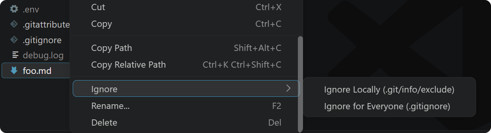
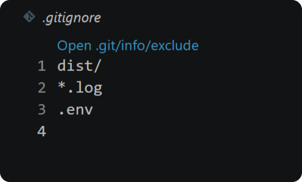
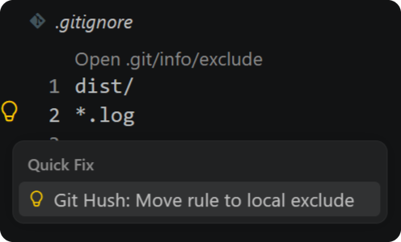

<h1> Git Hush – Ignore & Exclude</h1>

A Visual Studio Code extension to hide files from Git with a right-click – just for you, or for everyone.

Every Git repo has a private ignore file, `.git/info/exclude`, that works like `.gitignore` but is never committed. It's perfect for your own scratch files, notes, and editor clutter. Git Hush makes it as easy to use as `.gitignore`.

## Features

- Jump between `.gitignore` and its private counterpart with one click
- Move a rule from one file to the other with a 💡︎ quick fix
- Ignore files and folders from the Explorer right-click menu – click again to un-ignore
- Works with `.gitattributes` and its private counterpart, `.git/info/attributes`

Handles multiple selections, keeps rules sorted, never adds duplicates, and works in worktrees and submodules.

## Usage

### Ignore (and un-ignore) a file

Right-click any file or folder in the Explorer and open the **Ignore** submenu:

- **Ignore Locally** – adds it to `.git/info/exclude`, so it's hidden on your machine only
- **Ignore for Everyone** – adds it to `.gitignore`, so it's hidden for everyone

Both options are toggles: if the path is already listed in that file, the same option removes it.

### Jump between files

Open `.gitignore` and click **Open .git/info/exclude** at the top of the file. The exclude file has a matching link back. The same links work between `.gitattributes` and `.git/info/attributes`. Missing files are created for you.

### Move a rule

Put your cursor on any rule in `.gitignore`, press <kbd>Ctrl</kbd>+<kbd>.</kbd> (<kbd>Cmd</kbd>+<kbd>.</kbd> on macOS), and choose **Move rule to local exclude**. From the exclude file, the quick fix moves it back.

## Settings

- `gitHush.showInContextMenu` – toggle the **Ignore** submenu in the Explorer (default: on)

## Tip

Install [Syler.ignore](https://marketplace.visualstudio.com/items?itemName=Syler.ignore) for syntax highlighting in these files.
